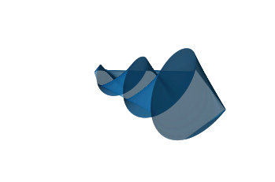
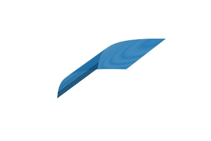

# Aprendizaje Automático. ¿Por qué las redes neuronales funcionan?

Este trabajo recoge el código usado en los experimentos del trabajo de fin de Máster titulado **Aprendizaje Automático.
¿Por qué las redes neuronales funcionan?** Está formado por las siguientes secciones:

1. [Aprendizaje supervisado](aprendizaje_supervisado)
2. [Aprendizaje no supervisado](aprendizaje_no_supervisado)
3. [Aprendizaje profundo](aprendizaje_profundo)
4. [Medidas de enredo](medidas_enredo)

Las redes neuronales son muy efectivas en resolver problemas complejos. ¿Por qué ocurre esto? 
En ocasiones, se habla de redes neuronales como cajas negras. El objetivo de este trabajo es dar un poco de luz en este aspecto. 
Para ello, intentaremos ver lo que ocurre en el interior de cada capa viendo los datos embebidos dentro de variedades como esta:

Con el objetivo de ver y medir, haciendo uso de matemática y geometría, que los datos se irán aplanando y generando variedades como

Puedes navegar por los enlaces de esta página para encontrar el código y explicaciones de los temas mencionados.
